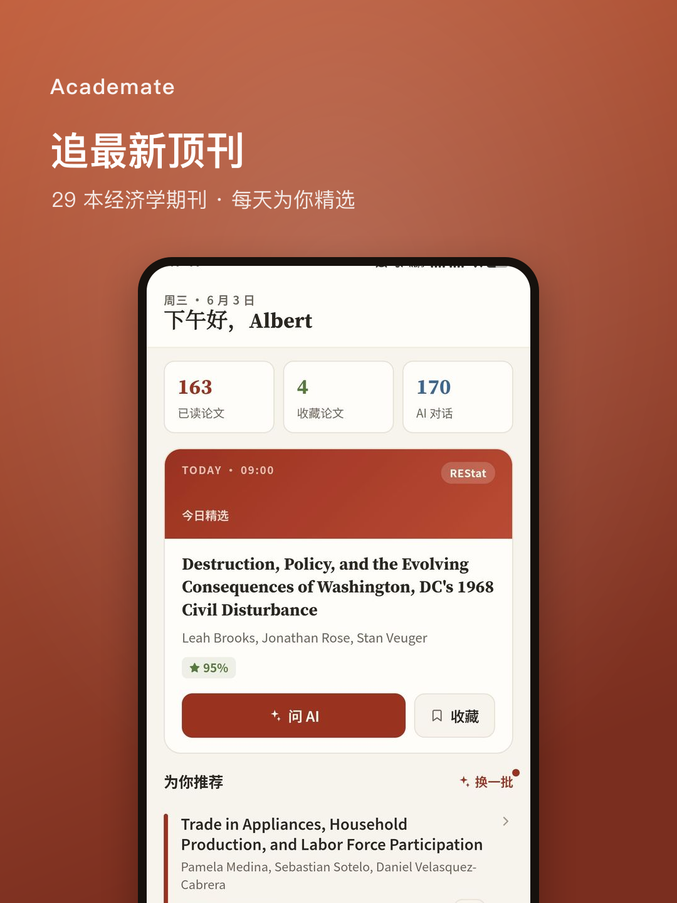
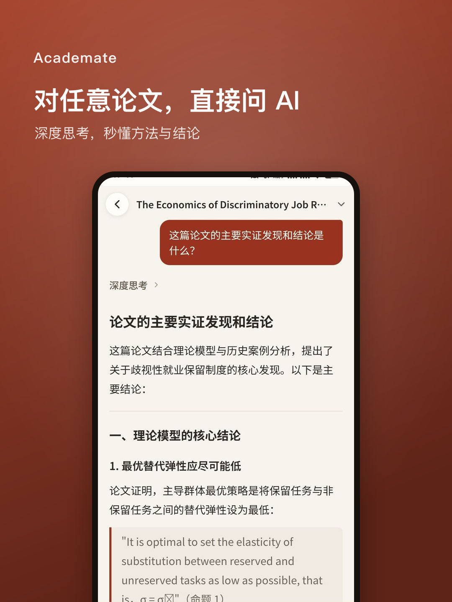
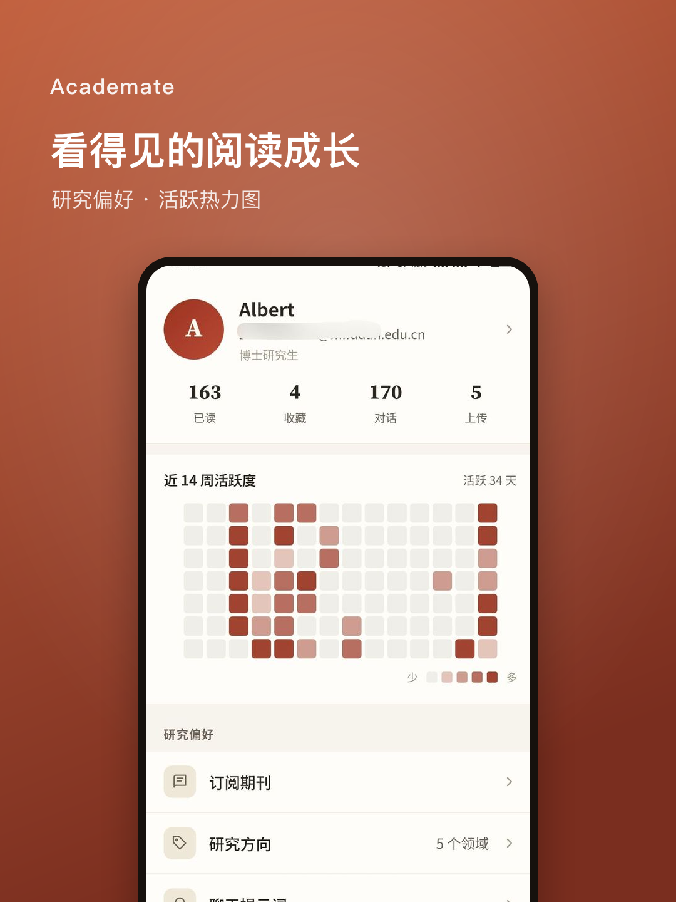

# Academate

**面向经济学研究者的 AI 论文阅读工具**
追踪 29 本经济学顶级期刊 · 上传 PDF 即问即答 · 30 秒读懂一篇论文

---

## 这是什么

Academate 是一款**面向科研人员的学术论文管理与 AI 辅助阅读工具**，由个人开发者运营，**免费、非经营性质**。

- 📡 **期刊追踪**：自动追踪 AER、QJE、JPE 等 29 本经济学顶刊新论文，按你的研究方向智能推荐并给出匹配度。
- 💬 **AI 对话式精读**：对任意论文直接提问，深度思考模式帮你看懂方法、数据与结论。
- 📂 **多格式文库**：PDF / Markdown 双视图，收藏、分类、标签，建立你的个人研究库。
- 📝 **上传你自己的 PDF**：上传论文全文，逐段提问、生成速读。

## 下载安装（Android）

| 渠道 | 链接 | 适合 |
| --- | --- | --- |
| **国内（推荐）** | <https://www.aiforecon.cn/downloads/academate-v3.3.apk> | 中国大陆，下载快 |
| **GitHub Release** | 见本仓库 [Releases](../../releases) | 海外 |

**安装步骤**
1. 用手机浏览器打开上面的下载链接，下载 `academate-v3.3.apk`。
2. 点击安装；首次安装系统会提示「允许安装未知来源应用」，按提示开启即可。
3. 打开 App，注册/登录后开始使用。

> 当前版本 **v3.3**。iOS 版本正在开发中，敬请期待。

## 截图

## 反馈与联系

- App 内「我的 → 意见反馈」可直接提交问题/建议，支持附图。
- 邮箱：support@aiforecon.cn

## 隐私

我们重视你的数据，App 仅申请「网络访问」权限，不收集定位、通讯录、相册等敏感信息。详见 [隐私政策](PRIVACY.md)。

---

© 2026 Academate · 个人开发者作品 · 免费非经营性工具

